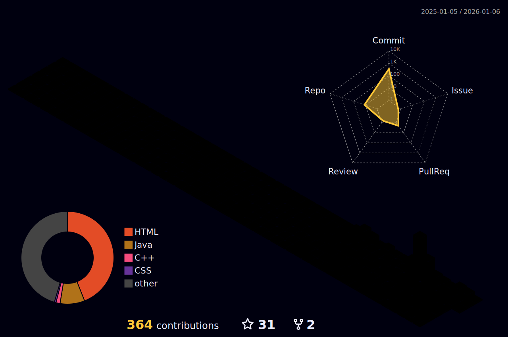

<div align="center">
  
  # 🙋🏻‍♂️ : VedisVigourous <br/>

</div>

<div align="center">
  
</div>

<br/>

```text
  _   _      _ _          ____ _ _   _   _       _        _ 
 | | | | ___| | | ___    / ___(_) |_| | | |_   _| |__    | |
 | |_| |/ _ \ | |/ _ \  | |  _| | __| |_| | | | | '_ \   | | 
 |  _  |  __/ | | (_) | | |_| | | |_|  _  | |_| | |_) |  | |
 |_| |_|\___|_|_|\___/   \____|_|\__|_| |_|\__,_|_.__/   (_) 
```
---

> **Current Status:** Oracle AI Certified & Backend Engineer

<a href="https://catalog-education.oracle.com/pls/certview/sharebadge?id=2EC9B50AAE0E57C91B9A0D7C3E27276E32A1D2760D8FB299F208125ADC931D38">
   
  <!--  -->
</a>

---

<div align="center">
<table>
  <tr>
    <td width="50%" valign="top" padding="15px">
      <h3 align="center">💻 Tech Stack</h3>
      <div align="center">
        
        <br/><br/>
        
      </div>
    </td>
    <td width="50%" valign="top padding="15px">
      <h3 align="center">🎨 Creative Studion</h3>
      <div align="center">
        <!--
         -->
    
    </div>
      <hr/>
       <h3 align="center">📙 Credly: </h3>
      <div align="center">
        <a href="https://www.credly.com/users/vadanta-kumar-chauhaan/badges#credly">
        
      </a>
        <!--
        <br/><br/>
        <a href="https://www.linkedin.com/in/vadanta-kumar-chauhaan-736581375"></a>&nbsp;
        <a href="https://instagram.com/vedant_chauhaan">
          </a>&nbsp;
        <a href="mailto:codegrounds666@gmail.com">
          
        </a>
        -->
      </div>
    </td>
  </tr>
</table>
</div> 

---

### 🚀 About Me
* 🧠 **Core Logic:** Mastering **DSA** & **OOPs** in **Java** & **C++**.
* 🤖 **AI:** Integrating **GenAI models** (Oracle Certified).
* 🐍 **Python:** Scripting & Automation.
* 🎬 **Visuals:** I edit technical tutorials and demos.

---

<h3 align="center">🛜 Connect to Me !</h3>

<div align="center"><a href="https://linkedin.com/in/vadanta-kumar-chauhaan-736581375"></a>&nbsp;&nbsp;<a href="https://www.instagram.com/vedant_chauhaan/"></a>&nbsp;&nbsp;<a href="mailto:codegrounds666@gmail.com"></a></div>

<br/>
<h3 align="center">🚀 Featured Projects</h3>

<table align="center">
  <tr>
  <td width="50%">
  <a href="https://github.com/VedisVigourous/LearnJava">
    
  </a>
  </td>
  <td width="50%">
      <a href="https://github.com/VedisVigourous/College_cpp">
        
      </a>
    </td>
  </tr>
  <tr>
    <td width="50%">
      <a href="https://github.com/VedisVigourous/HTML_CSS_Projects">
        
      </a>
    </td>
    <td width="50%">
      <div align="center">
        <h3>🚧 Work in Progress 🚧</h3>
      </div>
    </td>
  </tr>
</table>

<br/>

---

<br/>

<h3 align="center">🧱 My Code Architecture</h3>
<div align="center">
  
</div>
