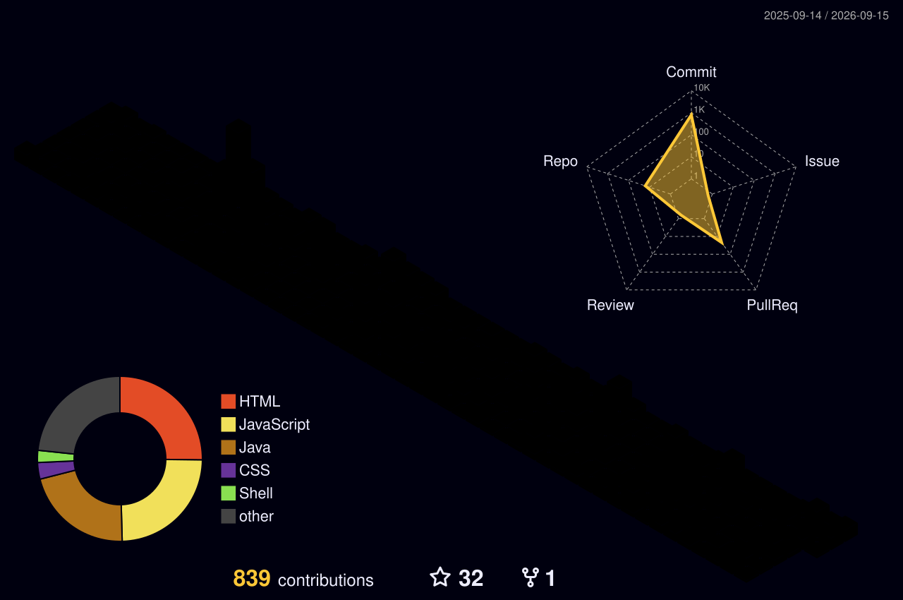

<div align="center">
  
  # 🙋🏻‍♂️ : VedisVigourous <br/>

</div>

<div align="center">
  
</div>

<br/>

```text
                                     ___           ___           ___       ___       ___     
                                    /\__\         /\  \         /\__\     /\__\     /\  \    
                                   /:/  /        /::\  \       /:/  /    /:/  /    /::\  \   
                                  /:/__/        /:/\:\  \     /:/  /    /:/  /    /:/\:\  \  
                                 /::\  \ ___   /::\~\:\  \   /:/  /    /:/  /    /:/  \:\  \ 
                                /:/\:\  /\__\ /:/\:\ \:\__\ /:/__/    /:/__/    /:/__/ \:\__\
                                \/__\:\/:/  / \:\~\:\ \/__/ \:\  \    \:\  \    \:\  \ /:/  /
                                     \::/  /   \:\ \:\__\    \:\  \    \:\  \    \:\  /:/  / 
                                     /:/  /     \:\ \/__/     \:\  \    \:\  \    \:\/:/  /  
                                    /:/  /       \:\__\        \:\__\    \:\__\    \::/  /
                                    \/__/         \/__/         \/__/     \/__/     \/__/    
```
---

> **Current Status:** Open Source Contributor | Cloud Architecture & GenAI Enthusiast | GSoC & GSSoC Aspirant

<div align="center">
  <a href="https://github.com/VedisVigourous/Resume/blob/main/Vadanta_Kumar_Chauhaan_Resume.pdf">
    </a>&nbsp;&nbsp;<a href="https://catalog-education.oracle.com/pls/certview/sharebadge?id=2EC9B50AAE0E57C91B9A0D7C3E27276E32A1D2760D8FB299F208125ADC931D38"></a>&nbsp;&nbsp;<a href="https://www.credly.com/users/vadanta-kumar-chauhaan/badges#credly"></a>
</div>

---


<div align="center">
<table>
  <tr>
    <td width="50%" valign="top" padding="15px">
      <h3 align="center">💻 Tech Stack</h3>
      <div align="center">
        
        <br/><br/>
        
        <br/><br/>
        
      </div>
    </td>
    <td width="50%" valign="top" padding="15px">
      <h3 align="center">🎨 Creative Studio</h3>
      <div align="center">
        
      </div>
      <hr/>
       <h4 align="center">🏆 Creative Milestones</h4>
      <ul>
        <li><b>2nd Place:</b> Reel Mind Pictures (Expressions 2021)</li>
        <li><b>Event Design:</b> Google Ambassador Freshers' Party</li>
      </ul>
    </td>
  </tr>
</table>
</div> 

---

### 🚀 About Me
* 🧠 **Core Logic:** Deep diving into **DSA** & **OOPs** optimization using **Java** & **C++**.
* ☁️ **Backend & Cloud:** Architecting data pipelines (Python) and securing environments on **GCP**.
* 🤖 **Applied AI:** Oracle Certified in the **GenAI** stack; leveraging Gemini APIs for custom accessibility tools and community events.
* 🌐 **Building:** Developing custom browser extensions (like **Spiker**) and actively prepping for **GSoC & GSSoC**.

---

### 🏆 Featured Certifications & Achievements
| Credential | Issuer | Verification |
| :--- | :--- | :--- |
| **Generative AI Professional** | Oracle | [View Certificate](./milestones/Oracle_GenAI.pdf) |
| **Technology Job Simulation** | Deloitte | [View Certificate](./milestones/Deloitte_TechnologyJobSimulation.pdf) |
| **Hackdays Hackathon** | Hackdays | [View Certificate](./milestones/Hackathon_01_Hackdays.pdf) |
| **Student Ambassador Program (Freshers' Party)** | Google | [View Certificate](./milestones/Google_StudentAmbassador.pdf) |

<details>
  <summary><b>✨ View 10+ More Certifications (Click to Expand)</b></summary>
  <br/>
  
  **🤖 AI & Modern Developer Workflows (Wilco)**
  * **GitHub Copilot Quests:** [Prompt Engineering](./milestones/WilcoLabs/prompt_engineering.png) | [Copilot Integration](./milestones/WilcoLabs/copilot_integration.png) | [Magic Quest](./milestones/WilcoLabs/magic_quest.png) | [Code Smarter](./milestones/WilcoLabs/code-smarter.png)
  
  **💻 Core Technical & Problem Solving**
  * **HackerRank:** [Basic Problem Solving](./milestones/HackerRank_PS_Basic.pdf) & [JavaScript Basic](./milestones/HackerRank_Js_Basic.pdf)
  * **freeCodeCamp:** [Legacy Responsive Web Design](./milestones/FreeCodeCamp_WebDesignV8.pdf)
  
  **🎨 Competitions, Hackathons & Community**
  * **CodeChef:** [Clash of Coders](./milestones/Codechef_ClashOfCoders.jpg)
  * **IIT Roorkee E-Cell:** [Participation Certificate](./milestones/IITRoorkie_Ecell.png)
  * **HackerRank Events:** [CodeWizard](./milestones/Hackerran_CodeWizard.png)
  
</details>

---

<h3 align="center">🛜 Connect with Me!</h3>

<div align="center">
  <a href="https://linkedin.com/in/vadanta"></a>&nbsp;&nbsp;
  <a href="https://www.instagram.com/vedant_chauhaan/"></a>&nbsp;&nbsp;
  <a href="mailto:vadanta592007@hotmail.com"></a>
</div>
<div align="center">
  <br/>
  
</div>

<br/>
<h3 align="center">🚀 Featured Projects</h3>

<table align="center">
  <tr>
    <td width="50%">
      <a href="https://github.com/hobo7676/hackdays-spiker">
        
      </a>
    </td>
    <td width="50%">
      <a href="https://github.com/VedisVigourous/Police-Daily-Performa">
        
      </a>
    </td>
  </tr>
  <tr>
    <td width="50%">
      <a href="https://github.com/VedisVigourous/Code-Solutions">
        
      </a>
    </td>
    <td width="50%">
      <a href="https://github.com/VedisVigourous/vedisvigourous.github.io">
        
      </a>
    </td>
  </tr>
</table>

<br/>

---

<br/>

<h3 align="center">🧱 My Code Architecture</h3>
<div align="center">
  
</div>
